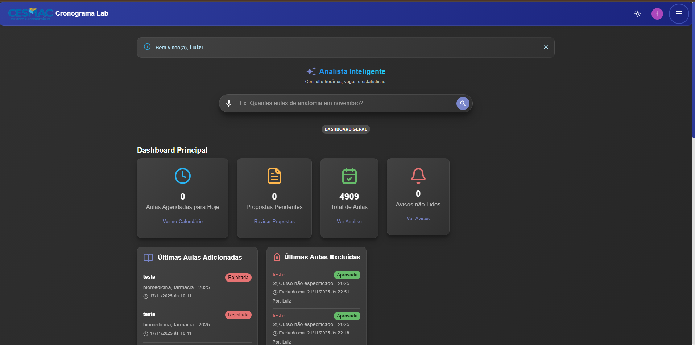

# 🧪 Cronograma Lab: Sistema Inteligente de Gestão Acadêmica

<p align="center">
  <a href="#-sobre">Sobre</a> •
  <a href="#-funcionalidades">Funcionalidades</a> •
  <a href="#-roadmap-de-desenvolvimento">Roadmap</a> •
  <a href="#-screenshots">Screenshots</a> •
  <a href="#️-tecnologias">Tecnologias</a> •
  <a href="#️-instalação">Instalação</a>
</p>

## 🎯 Sobre

O Cronograma Lab é uma plataforma web desenvolvida para revolucionar o agendamento de laboratórios em instituições de ensino. Mais do que um simples calendário, o sistema evoluiu para uma ferramenta de Business Intelligence (BI), integrando Inteligência Artificial (Llama 3.3) para análise de dados e Notificações via Telegram, garantindo que coordenadores e professores tenham insights estratégicos e comunicação em tempo real.

## 📸 Screenshots

<div align="center">
  
  <br>
  <em>Painel Principal com Gráficos e Assistente de IA</em>
</div>
</div>

## ✨ Funcionalidades

### 🤖 Fase 5: Inovação e Inteligência (NEW!)

| Funcionalidade | Descrição | Impacto |
| :--- | :--- | :--- |
| 🧠 **Assistente IA** | NLP integrada ao Dashboard. Pergunte: "Qual a taxa de ocupação este mês?" e receba gráficos instantâneos. | Elimina a criação manual de relatórios. |
| 🔍 **Busca "Fuzzy"** | Busca inteligente que entende contexto (ex: "anatômia" encontra "Lab. Anatomia"). | Melhora a UX de pesquisa drasticamente. |
| 📱 **Bot Telegram 2.0** | Notificações automáticas com links diretos para o calendário no momento da ação. | Comunicação instantânea com a coordenação. |
| 🔮 **Predição de Ociosidade** | A IA identifica laboratórios subutilizados e sugere otimizações. | Melhor aproveitamento de recursos físicos. |

## 🗺️ Roadmap de Desenvolvimento

O projeto está em constante evolução. As próximas fases de desenvolvimento focam em aprimorar a experiência do usuário e expandir as capacidades de análise e gestão.

### 🛠️ Fase 1: Estrutura Base e Agendamento Essencial

| Funcionalidade | Descrição | Benefício |
| :--- | :--- | :--- |
| **Agendamento Básico** | Funcionalidade principal de agendamento de laboratórios com controle de datas e horários. | Permite o uso fundamental do sistema para a gestão de recursos. |
| **Controle de Acesso** | Autenticação de usuários (coordenadores, professores) via Firebase Auth. | Garante a segurança e a integridade dos dados de agendamento. |
| **Visualização de Calendário** | Exibição do cronograma em formato de calendário mensal e semanal. | Oferece uma visão clara da disponibilidade dos laboratórios. |

### 🚀 Fases 2 e 3: Melhorias de UX e Interface

| Funcionalidade | Descrição | Benefício |
| :--- | :--- | :--- |
| **Filtros Dinâmicos** | Adição de filtros por laboratório, curso, status e dia da semana na visualização do cronograma. | Permite aos usuários localizar rapidamente as informações de interesse, melhorando a navegabilidade. |
| **Visualização de Ocupação** | Mapa de calor simplificado que exibe a ocupação horária do laboratório, indicando aulas simultâneas. | Ajuda coordenadores e proponentes a identificar horários de pico e janelas de disponibilidade. |
| **Drag-and-Drop (D&D)** | Funcionalidade de arrastar e soltar para propostas de aula pendentes, permitindo que coordenadores as movam facilmente no calendário. | Agiliza o processo de aprovação e reagendamento de propostas. |
| **Contador de Pendências** | Notificação visual no painel de avisos e na navegação principal para propostas de aula aguardando aprovação. | Garante que nenhuma proposta seja esquecida, melhorando o tempo de resposta. |
| **Atualização em Tempo Real** | Uso de `onSnapshot` do Firestore para garantir que o painel de avisos e o calendário reflitam as alterações instantaneamente. | Elimina a necessidade de recarregar a página, proporcionando uma experiência fluida. |

### 📊 Fase 4: Novas Funcionalidades Estratégicas

| Funcionalidade | Descrição | Benefício |
| :--- | :--- | :--- |
| **Dashboard de Análise** | Novo módulo com gráficos e métricas de uso dos laboratórios (por curso, tipo de atividade, turno, mês). Inclui a métrica de **Proposta vs. Aprovação**. | Fornece dados valiosos para a gestão, auxiliando na tomada de decisões sobre recursos e planejamento. |
| **Exportação para Calendário (.ics)** | Permite aos usuários exportar o cronograma filtrado para seus calendários pessoais (Google Calendar, Outlook, Apple Calendar) via arquivo `.ics`. | Facilita a organização pessoal e a integração com ferramentas de produtividade. |
| **Integração de Feriados** | O calendário agora exibe e destaca automaticamente os feriados nacionais, estaduais e municipais (com base em dados mockados/API). | Evita agendamentos em dias não letivos, melhorando a precisão do cronograma. |
| **Otimização de Consultas** | Implementação de indexação e normalização de dados para consultas mais rápidas e eficientes no Firebase Firestore. | Reduz a latência e o custo operacional do banco de dados. |

## 🛠️ Tecnologias

O projeto foi construído utilizando as melhores práticas de desenvolvimento moderno:

| Categoria | Tecnologias |
| :--- | :--- |
| **Frontend** | React (CRA), Material-UI (MUI), Context API |
| **Backend / DB** | Firebase (Firestore, Auth, Hosting) |
| **Inteligência Artificial** | Groq API (Model: Llama 3.3 70b Versatile) |
| **Integrações** | Telegram Bot API, Google Calendar Export |
| **Visualização de Dados** | Chart.js, React-Chartjs-2 |
| **Utilitários** | Day.js, @dnd-kit, File-saver, XLSX |

## 📂 Estrutura do Projeto

```
cronograma-lab/
├── public/
├── src/
│   ├── components/      # Componentes reutilizáveis (Botões, Modais)
│   ├── contexts/        # Gerenciamento de estado global (Auth, Theme)
│   ├── hooks/           # Custom Hooks (useAuth, useFirestore)
│   ├── pages/           # Páginas da aplicação (Dashboard, Agenda)
│   ├── services/        # Integrações (API Groq, Telegram, Firebase)
│   ├── styles/          # Estilização global e temas MUI
│   └── utils/           # Funções auxiliares e formatadores
└── ...
```

## ⚙️ Instalação

Siga os passos abaixo para rodar o projeto localmente:

1.  **Clone o repositório**

    ```bash
    git clone https://github.com/luizedu0494/cronograma-lab-frontend.git
    cd cronograma-lab-frontend
    ```

2.  **Instale as dependências**

    ```bash
    npm install
    ```

3.  **Configure as Variáveis de Ambiente**

    Crie um arquivo `.env` na raiz e preencha com suas chaves:

    ```
    # Firebase
    REACT_APP_FIREBASE_API_KEY=seu_api_key
    REACT_APP_FIREBASE_PROJECT_ID=seu_project_id
    # ... (outras configs do firebase)

    # Integrações Inteligentes
    REACT_APP_TELEGRAM_BOT_TOKEN=seu_token_telegram
    REACT_APP_TELEGRAM_CHAT_ID=id_chat_destino
    REACT_APP_GROQ_API_KEY=sua_chave_groq
    ```

4.  **Execute o projeto**

    ```bash
    npm start
    ```

## 🚀 Deploy

Para publicar a aplicação em produção no Firebase Hosting:

1.  **Gerar build otimizado**

    ```bash
    npm run build
    ```

2.  **Enviar para o servidor**

    ```bash
    firebase deploy --only hosting
    ```

## 🤝 Contribuição

Contribuições são sempre bem-vindas!

1.  Faça um **Fork** do projeto.
2.  Crie uma **Branch** para sua feature (`git checkout -b feature/MinhaFeature`).
3.  Faça o **Commit** (`git commit -m 'Adicionando MinhaFeature'`).
4.  Faça o **Push** (`git push origin feature/MinhaFeature`).
5.  Abra um **Pull Request**.

<div align="center">
  Desenvolvido por Luiz Eduardo
  <br />
  <a href="https://github.com/luizedu0494">GitHub</a>
</div>
