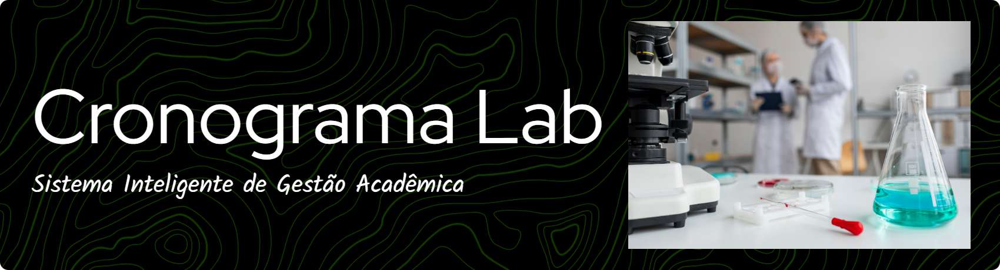
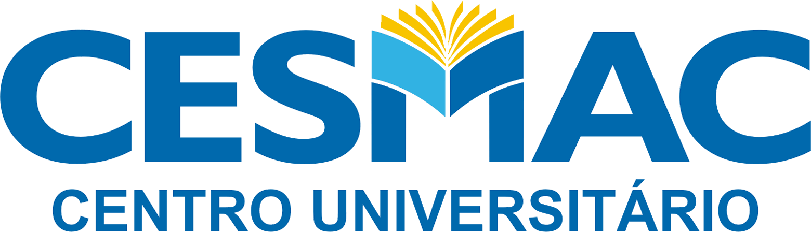
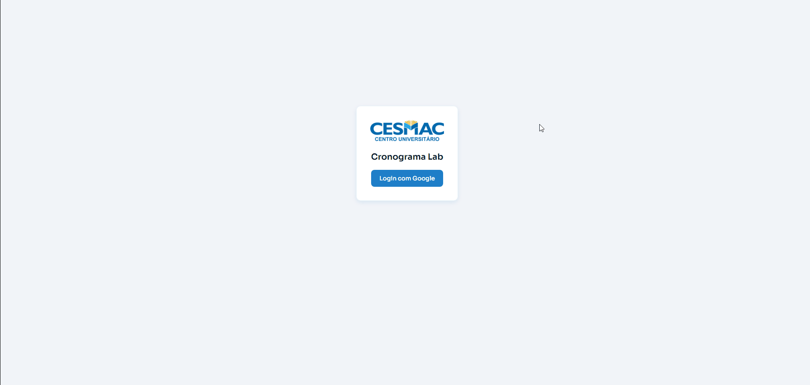
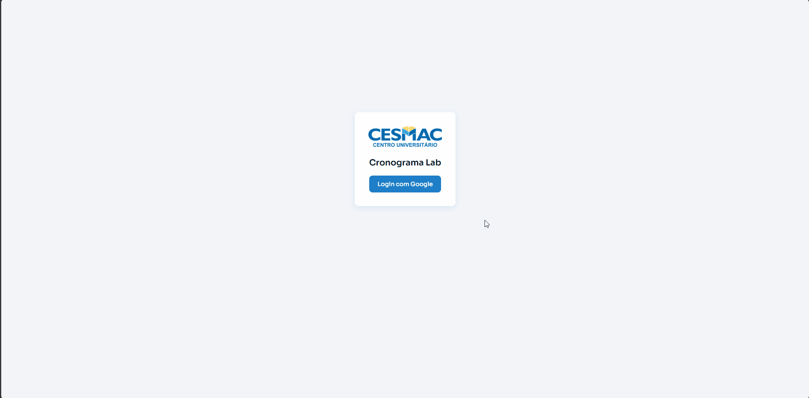
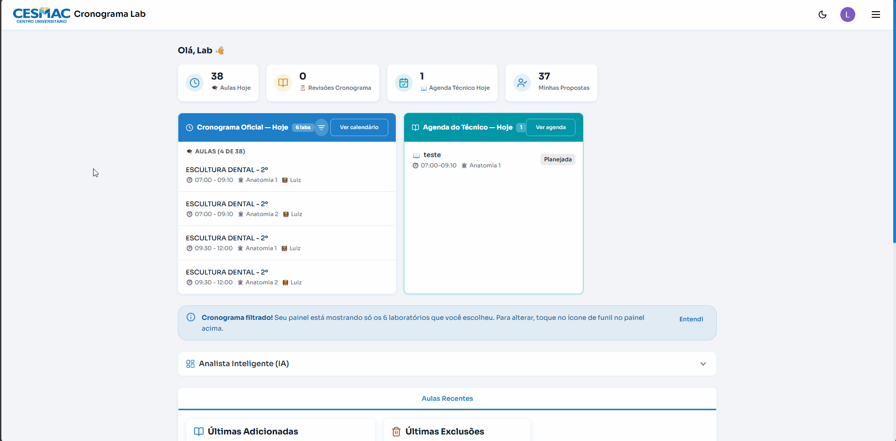
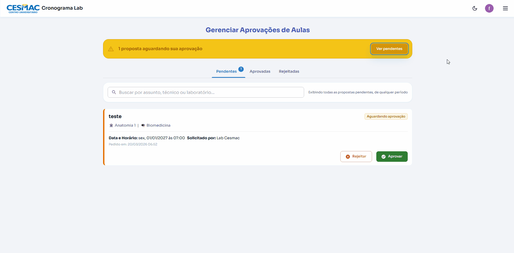
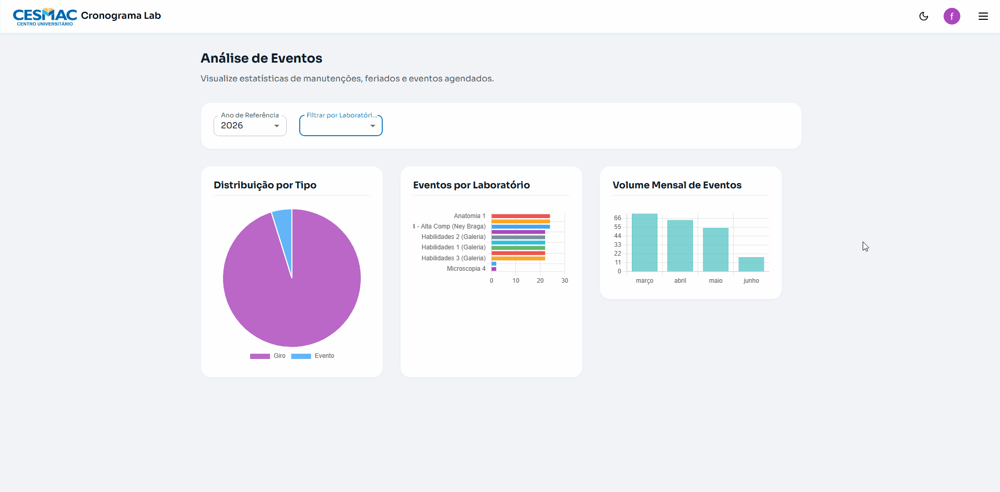
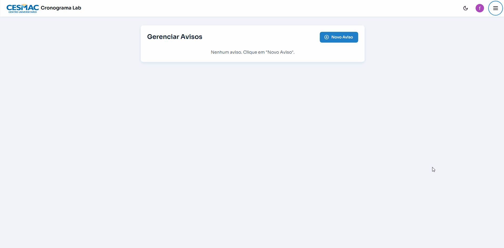
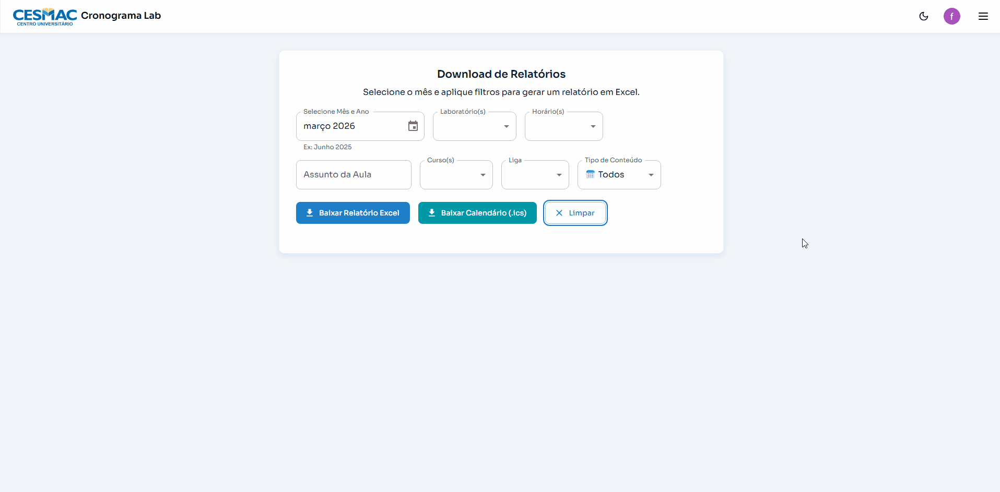

# CronoLab — Cronograma de Laboratórios

> Sistema de gestão de cronogramas e agendamentos para os laboratórios do **Centro Universitário CESMAC**, Maceió — AL.



<p align="center">
  
</p>

<p align="center">
  <a href="#sobre">Sobre</a> •
  <a href="#novidades-v2">Novidades v2</a> •
  <a href="#demonstrações">Demonstrações</a> •
  <a href="#perfis-de-acesso">Perfis</a> •
  <a href="#funcionalidades">Funcionalidades</a> •
  <a href="#tecnologias">Tecnologias</a> •
  <a href="#instalação">Instalação</a>
</p>

<p align="center">
  
  
  
  
  
</p>

<p align="center">
  <a href="https://cronolab-novo.web.app"><strong>🌐 Ver sistema online →</strong></a>
</p>

---

## Sobre

O **CronoLab** é um sistema web desenvolvido para resolver um problema real do dia a dia dos laboratórios do CESMAC: a gestão manual e descentralizada de agendamentos.

O sistema centraliza o cronograma de todos os laboratórios em uma única plataforma, com perfis distintos para coordenadores, técnicos e alunos. Substitui planilhas e processos manuais por um painel inteligente com verificação automática de conflitos, análise de ocupação e notificações em tempo real.

**Destaques:**
- 🏫 Desenvolvido para uso real no CESMAC — não é um projeto de demonstração
- ⚡ Roda 100% no plano gratuito do Firebase (Spark) — zero custo de infraestrutura
- 📱 Responsivo para desktop e celular
- 🌙 Dark mode com identidade visual da instituição
- 🤖 Assistente IA para consultas em linguagem natural sobre o cronograma

---

## Novidades v2

> Resumo das melhorias implementadas nesta versão.

### 🎨 Identidade Visual CESMAC

O sistema agora usa as cores institucionais do CESMAC extraídas diretamente do logo oficial:

| Token | Cor | Uso |
| :--- | :--- | :--- |
| **Azul principal** | `#1E7EC8` | Botões, links, KPIs, navbar |
| **Azul claro** | `#4AADE8` | Destaques, chips, dark mode |
| **Dourado** | `#F5C518` / `#D4940A` | Revisões, alertas, avisos |

A fonte foi atualizada de **Inter** para **Sora** — mais legível no mobile e com personalidade mais acadêmica.

O dark mode usa fundo **azul-marinho profundo** (`#0B0F18`) que conversa com a identidade da instituição.

---

### 🧭 Onboarding Guiado do Técnico

Técnicos que acessam o sistema pela primeira vez em um dispositivo passam por um fluxo guiado de 3 passos antes de ver o painel:

```
Passo 1 — Boas-vindas
  Explica o que o sistema faz e como o painel vai ajudar no dia a dia.

Passo 2 — Escolha dos laboratórios
  31 labs agrupados por tipo. Seleção individual ou por grupo inteiro.
  Pensado para toque no celular (chips grandes, scroll natural).

Passo 3 — Confirmação
  Revisão dos labs escolhidos com chips removíveis.
  Pode voltar e alterar antes de confirmar.
```

> **Aparece apenas uma vez por dispositivo/navegador.** Após concluir, nunca mais aparece — salvo em `localStorage` por `uid`. Cada dispositivo tem sua própria configuração independente, sem conflito entre técnicos que compartilham contas.

Para alterar os laboratórios depois, basta clicar no ícone de funil no painel "Cronograma Oficial — Hoje".

---

### 🔥 Correções Firebase (plano Spark)

Esta versão resolve problemas críticos que poderiam forçar upgrade para o plano pago:

| Problema | Impacto | Correção |
| :--- | :--- | :--- |
| **Cloud Functions ativas** | Exige plano Blaze obrigatoriamente | Código comentado, `firebase.json` sem bloco `functions` |
| **`onSnapshot` aninhado em `PainelAvisos`** | Criava N listeners sem cleanup, esgotando leituras/dia | Substituído por `getDocs` pontual por uid |
| **`Promise.all` por aviso em `PaginaInicial`** | 1 leitura por aviso a cada atualização do feed | Substituído por `getDocs` único + cache em `localStorage` |
| **`firebase-admin` no frontend** | Não funciona no browser, aumentava bundle, risco de segurança | Removido do `package.json` |
| **`FieldValue` inexistente no SDK v9+** | Crash em runtime ao incrementar contador | Corrigido para `increment()` do SDK modular |

---

### 🗂️ Estrutura de `localStorage` por usuário

Todas as preferências do técnico ficam salvas localmente por `uid`, sem custo de leitura no Firestore:

| Chave | Conteúdo |
| :--- | :--- |
| `labsFavoritos_<uid>` | Array de nomes dos labs filtrados |
| `onboardingConcluido_<uid>` | `"true"` após concluir o onboarding |
| `labHintVisto_<uid>` | `"true"` após dispensar o hint pós-onboarding |
| `avisosLidos_<uid>` | Array de IDs de avisos já lidos |

---

## Demonstrações

### 🔐 Login



---

### 🔬 Técnico

**Onboarding — configuração guiada na primeira visita**



**Cronograma — visão semanal pelo técnico**


**Filtro de laboratórios — cronograma personalizado**



**Propor aula**


**Agenda privada do técnico**


---

### 👨‍💼 Coordenador

**Painel principal — visão geral do dia e do semestre**


**Calendário — visualização semanal do cronograma**


**Aprovar propostas**



**Análise de aulas — gráficos e métricas**


**Análise de eventos**



**Gerenciar avisos**



**Propor evento de manutenção**


---

### 📋 Compartilhado

**Assistente IA — consultas em linguagem natural**


**Baixar cronograma — Excel e calendário .ics**



**Histórico de aulas**


**Ajuda / FAQ**


---


O sistema tem três perfis com experiências completamente diferentes.

### 👨‍💼 Coordenador

Visão estratégica e gestão completa do sistema.

**Painel inicial:**

| KPI | O que mostra |
| :--- | :--- |
| Aulas hoje | Total de aulas aprovadas no dia |
| Revisões hoje | Total de revisões no cronograma do dia |
| Aulas 2026 | Total de aulas cadastradas no ano |
| Revisões 2026 | Total de revisões no ano |
| Pendentes | Propostas aguardando aprovação (com badge de alerta) |
| Eventos 2026 | Total de eventos de manutenção no ano |

**Funcionalidades exclusivas:**

- ✅ Aprovar, editar e rejeitar propostas de aula e evento
- ✅ Gerenciar usuários (aprovar novos cadastros, alterar cargos)
- ✅ Gerenciar grupos e períodos
- ✅ Criar e gerenciar avisos para todos os usuários
- ✅ Análise de aulas — gráficos de ocupação por laboratório, curso, turno e mês
- ✅ Análise de eventos — métricas de manutenção
- ✅ Verificar integridade dos dados
- ✅ Abas "Aulas Recentes" e "Eventos Recentes" no painel

**Menu exclusivo do coordenador:**

```
Aprovações (com contador de pendentes)
Análise de Aulas
Análise de Eventos
Integridade de Dados
Usuários
Eventos de Manutenção
Gerenciar Avisos
```

---

### 🔬 Técnico

Visão operacional focada no dia a dia dos laboratórios.

**Onboarding na primeira visita:**

Ao abrir o sistema pela primeira vez em um dispositivo, o técnico passa por um fluxo guiado de 3 passos para configurar quais laboratórios quer monitorar. Depois disso, nunca mais aparece — salvo por navegador.

**Painel inicial:**

| KPI | O que mostra |
| :--- | :--- |
| Aulas hoje | Aulas no cronograma oficial do dia |
| Revisões cronograma | Revisões oficiais do dia |
| Agenda técnico hoje | Revisões na agenda privada do técnico |
| Minhas propostas | Total de propostas que o técnico criou |

**Painel do dia — dois painéis lado a lado:**

| Painel | O que mostra |
| :--- | :--- |
| Cronograma Oficial — Hoje | Aulas e revisões aprovadas, filtradas pelos laboratórios favoritos do técnico. Ícone de funil para alterar o filtro a qualquer momento. |
| Agenda do Técnico — Hoje | Revisões e preparações registradas na agenda privada do técnico (separadas do cronograma oficial). |

**Funcionalidades exclusivas:**

- ✅ Agenda privada de revisões (calendário pessoal separado do cronograma oficial)
- ✅ Filtro de laboratórios favoritos — salvo por dispositivo no `localStorage`
- ✅ Onboarding guiado na primeira visita
- ✅ Minhas propostas — acompanhar status das propostas enviadas
- ✅ Minhas designações — ver labs atribuídos pela coordenação

**Menu exclusivo do técnico:**

```
Propor Aula
Designações
Minhas Propostas
Revisões (agenda privada)
```

---

### 👨‍🎓 Aluno / Usuário comum

Visão somente leitura do cronograma.

- ✅ Visualizar calendário de aulas aprovadas
- ✅ Histórico de aulas
- ✅ Mural de avisos
- ✅ Calendário acadêmico (quando ativado pelo coordenador)
- ✅ Baixar cronograma em PDF/Excel
- ❌ Sem acesso a formulários, gestão ou análises

---

### Comparativo rápido

| Funcionalidade | Coordenador | Técnico | Aluno |
| :--- | :---: | :---: | :---: |
| Ver calendário | ✅ | ✅ | ✅ |
| Mural de avisos | ✅ | ✅ | ✅ |
| Baixar cronograma | ✅ | ✅ | ✅ |
| Propor aula | ✅ | ✅ | ❌ |
| Aprovar propostas | ✅ | ❌ | ❌ |
| Onboarding de labs | ❌ | ✅ | ❌ |
| Agenda privada | ❌ | ✅ | ❌ |
| Filtro de labs favoritos | ❌ | ✅ | ❌ |
| Análise de dados | ✅ | ❌ | ❌ |
| Gerenciar usuários | ✅ | ❌ | ❌ |
| Gerenciar avisos | ✅ | ❌ | ❌ |
| Verificar integridade | ✅ | ❌ | ❌ |

---

| Funcionalidade | Descrição | Status |
| :--- | :--- | :--- |
| **Controle de Acesso** | Autenticação via Google (Firebase Auth) com perfis: Coordenador, Técnico e Aluno | ✅ |
| **Proposta de Aula** | Formulário completo com seleção de laboratório, curso, horário e verificação de conflito | ✅ |
| **Proposta de Evento** | Agendamento de eventos de manutenção e outros com bloqueio de laboratório | ✅ |
| **Verificação de Conflito** | Detecta conflitos de horário e laboratório automaticamente | ✅ |
| **Calendário** | Visualização semanal do cronograma com navegação e filtros | ✅ |
| **Painel do Técnico** | Cronograma do dia filtrado por laboratórios favoritos + agenda privada | ✅ |
| **Onboarding Guiado** | Fluxo de 3 passos na primeira visita para configurar laboratórios — mobile-first | ✅ **novo** |
| **Tema CESMAC** | Identidade visual com cores do logo institucional, dark mode com marinho profundo | ✅ **novo** |
| **Gestão de Aprovações** | Coordenador aprova, edita ou rejeita propostas pendentes | ✅ |
| **Mural de Avisos** | Comunicados da coordenação com status de leitura por usuário | ✅ |
| **Análise de Dados** | Gráficos de ocupação por laboratório, curso, turno e mês | ✅ |
| **Exportação** | Download do cronograma em PDF e Excel | ✅ |
| **Notificações Telegram** | Alertas automáticos para ações de agendamento | ✅ |
| **Assistente IA** | Consultas em linguagem natural sobre o cronograma (sem API externa) | ✅ |

---

## Roadmap

### ✅ Fase 1 — Base e Agendamento (Concluída)

Agendamento, controle de acesso, calendário e verificação de conflitos.

### ✅ Fase 2 — UX e Interface (Concluída)

Filtros dinâmicos, contador de pendências, agenda do técnico, dark mode.

### ✅ Fase 3 — Identidade Visual e Onboarding (Concluída — v2)

| Entrega | Descrição |
| :--- | :--- |
| **Tema CESMAC** | Paleta baseada no logo oficial, fonte Sora, dark mode marinho |
| **Onboarding do técnico** | Fluxo guiado de 3 passos, mobile-first, salvo por dispositivo |
| **Correções Firebase Spark** | Remoção de Cloud Functions, fix de listeners e contadores |
| **Segurança** | Remoção de `firebase-admin` do frontend |

### 🔮 Fase 4 — Próximos Passos

| Funcionalidade | Descrição |
| :--- | :--- |
| **GIFs no README** | Demonstrações animadas do onboarding e do tema |
| **PWA** | Instalação como app no celular (manifesto + service worker) |
| **Notificações push** | Avisos urgentes direto no celular via FCM (requer plano Blaze) |
| **Predição de ociosidade** | IA identifica laboratórios subutilizados |

---

## Tecnologias

| Categoria | Tecnologia | Versão | Para que serve |
| :--- | :--- | :--- | :--- |
| **UI Framework** | React | 19 | Componentes e estado da interface |
| **Build Tool** | Vite | 7 | Build e servidor de desenvolvimento |
| **Componentes** | Material-UI (MUI) | 7 | Design system e componentes visuais |
| **Roteamento** | React Router | 7 | Navegação entre páginas |
| **Banco de Dados** | Firebase Firestore | 11 | Dados em tempo real, plano Spark |
| **Autenticação** | Firebase Auth | 11 | Login com conta Google |
| **Hospedagem** | Firebase Hosting | — | Deploy estático, plano Spark (gratuito) |
| **Tipografia** | Sora (Google Fonts) | — | Fonte principal, identidade CESMAC |
| **Gráficos** | Chart.js + React-Chartjs-2 | 4/5 | Dashboards de análise |
| **Animações** | Framer Motion | 12 | Transições e animações de UI |
| **Datas** | Day.js | 1.11 | Manipulação e formatação de datas |
| **Drag & Drop** | @dnd-kit | 6/9/10 | Arrastar e reorganizar elementos |
| **Exportação** | ExcelJS + File-saver | — | Download de relatórios Excel |
| **IA** | Groq API (Llama 3.3) | — | Assistente de consultas em linguagem natural |
| **Notificações** | Telegram Bot API | — | Alertas de agendamento |

> **Por que não TypeScript?** O projeto foi iniciado em JavaScript para priorizar velocidade de entrega. A migração para TS é um item do roadmap futuro.

---

## Instalação

### Pré-requisitos

- [Node.js](https://nodejs.org/) 18 ou superior
- [Firebase CLI](https://firebase.google.com/docs/cli) (apenas para deploy)
- Conta Google com acesso ao projeto Firebase `cronolab-novo`

### Passo a passo

```bash
# 1. Clone o repositório
git clone https://github.com/luizedu0494/cronograma-lab-frontend.git
cd cronograma-lab-frontend

# 2. Instale as dependências
npm install

# 3. Execute localmente
npm run dev
# Acesse: http://localhost:5173
```

### Variáveis de ambiente

Crie um arquivo `.env` na raiz (opcional — apenas para integrações externas):

```env
# Assistente IA (Groq)
VITE_GROQ_API_KEY=sua_chave_groq

# Notificações Telegram (opcional)
VITE_TELEGRAM_BOT_TOKEN=seu_token
VITE_TELEGRAM_CHAT_ID=id_do_chat
```

> As configurações do Firebase já estão em `src/firebaseConfig.jsx` — não é necessário `.env` para rodar o sistema localmente.

### Estrutura do projeto

```
cronograma-lab-frontend/
├── docs/                    # GIFs de demonstração para o README
├── public/                  # Assets estáticos
├── src/
│   ├── assets/              # Imagens e fontes
│   ├── components/          # Componentes reutilizáveis
│   ├── constants/           # Laboratórios e cursos cadastrados
│   ├── hooks/               # Custom hooks
│   ├── ia-estruturada/      # Motor do Assistente IA (sem API externa)
│   ├── utils/               # Funções auxiliares
│   ├── App.jsx              # Roteamento e layout principal
│   ├── firebaseConfig.jsx   # Configuração do Firebase
│   ├── theme.jsx            # Tema MUI com cores CESMAC
│   └── [Telas].jsx          # Páginas da aplicação
├── firestore.rules          # Regras de segurança do Firestore
├── firebase.json            # Configuração do Firebase Hosting
└── vite.config.jsx          # Configuração do Vite
```

---

## Deploy

```bash
# Build de produção
npm run build

# Preview isolado — não afeta o site principal
firebase hosting:channel:deploy preview-teste --expires 7d

# Deploy para produção
firebase deploy --only hosting

# Publicar regras do Firestore
firebase deploy --only firestore:rules
```

---

## Configuração do GitHub

Para deixar o repositório mais profissional e fácil de encontrar, configure no GitHub:

**Descrição (About)** — clique no ⚙️ ao lado de "About" no repositório e adicione:
```
Sistema web para gestão de cronogramas dos laboratórios do CESMAC · React 19 · Firebase · MUI
```

**Topics** — adicione as tags:
```
react  firebase  vite  material-ui  javascript  academic  scheduler  cesmac  laboratório  cronograma
```

**Website** — adicione o link do sistema:
```
https://cronolab-novo.web.app
```

---

## Contribuição

1. Faça um **Fork** do projeto
2. Crie uma **Branch** (`git checkout -b feature/MinhaFeature`)
3. Faça o **Commit** (`git commit -m 'feat: MinhaFeature'`)
4. Faça o **Push** (`git push origin feature/MinhaFeature`)
5. Abra um **Pull Request**

---

<div align="center">
  Desenvolvido por <strong>Luiz Eduardo</strong> para o CESMAC — Centro Universitário de Maceió
  <br/><br/>
  <a href="https://github.com/luizedu0494">GitHub</a>
</div>
